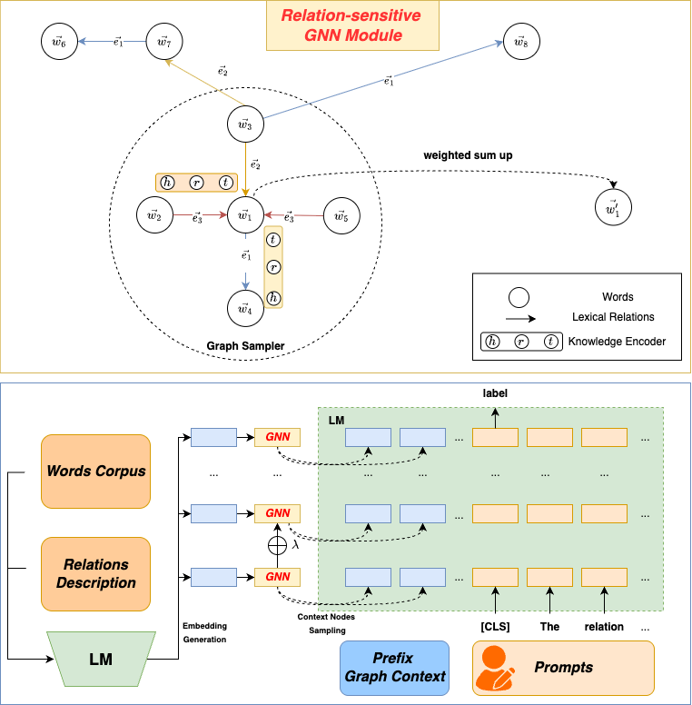

# Introducing Graph Context into Language Models through Parameter-Efficient Fine-Tuning for Lexical Relation Mining
Efficiently tuning language models using an inherent knowledge graph for lexical relation mining tasks.

University of Science and Technology of China (USTC)

[](https://openreview.net/forum?id=K6aGniOrFM)

<p align="center">
  
</p>


## Getting Started
You can simply run the following scripts: train_lrc.py, train_causal.py, and train_le.py to reproduce experimental results. An example is as follows:
```
python train_le.py \
        --dataset_path ./dataset/le/splits \
        --dataset lexical \
        --plm_path meta-llama/Meta-Llama-3-8B \
        --peft FT \
        --epoch 30 \
        --lr 1e-5 \
        --lr_min 1e-6
```
The folder `./dataset/le` contains the lexical entailment (LE) datasets. The lexical relation classification datasets can be accessed from [huggingface](https://huggingface.co/datasets/relbert/lexical_relation_classification).


